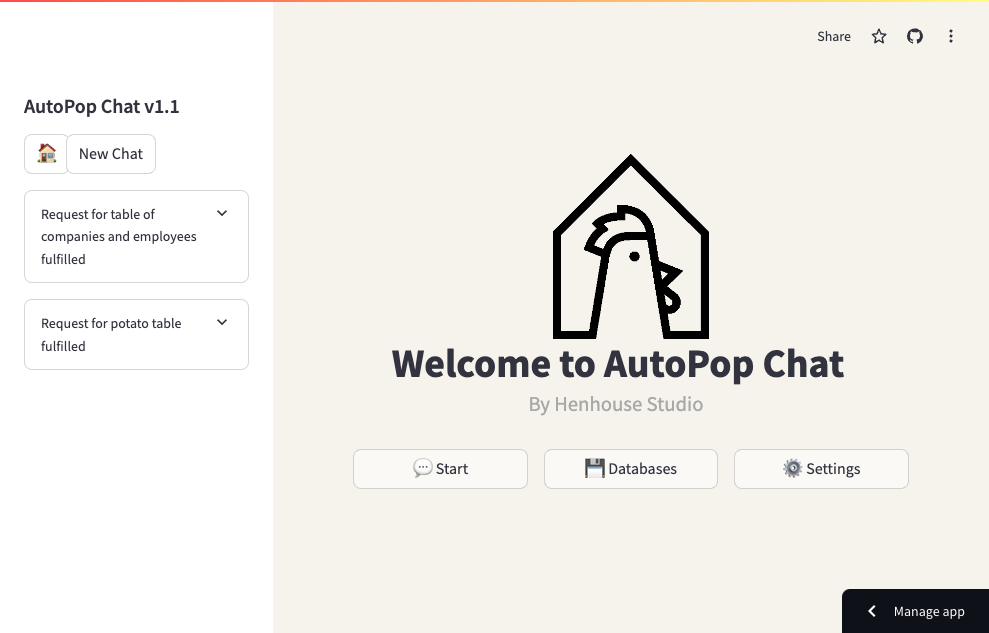

# **AutoPop ChatBot 🤖**

This repository is a chat-based database merging/retrieval system which also can perform general LLM capabilities.




# **How it Works 🚀**

The idea of this app is to allow users to find more _serendipitous_ links between entries. This means that standard entry matching is not utilized, but rather more "fuzzy" matches between the rows from two or more separate tables.

How it generally works:

1. The program first fetches the tables (currently they're taken from Notion and stored in a folder as .csv's, which may be updated soon). It requires a Database ID to a Notion page which has a specific structure, namely that it should be an accessible table containing other tables with a column for tags (only the "Fact" tag is required).

The system distinguished between two table types:

- **Regular Tables:** These are tables that tend to get updated regularly. Think for example a table containing work employees. Employees don't always stick around and also get hired at other places, meaning that the entries in this table get changed (semi-)regularly.

- **Fact Tables:** These are things that are more "static" in nature, such as a table containing location names.

2. We then rank the tables using `gpt-4o-mini` (or whichever of the three models you prefer) based on how relevant they are to the prompt.

Through this, we select a table as the main one to populate. Meanwhile, the other tables in the ranking are used either to be matched with (the regular tables), or for fact enrichment (the fact tables).

3. Afterwards, we enrich the tables with facts to allow for more fuzzy matches. Then, we combine the tables based on how similar the rows are.

This is calculated by first making the model emphasize the importance of certain columns more (i.e., probably the column `Company Name` is more relevant for matching compared to most others). Continuing from this, a text encoder encodes the entries from both tables for all entries, with cosine similarity being used to check if any two rows are a good enough match.

We also check both for if the similarity/confidence between the entries is high enough, then check the overall confidence between the two tables.

If it's too low, we skip and try the next one. Otherwise, the tables get merged and have a confidence score added.

4. The table is now fully generated! If there was only one table required, then it just immediately returns the table and skips most of step 3. Otherwise, it goes into the step.


You can test out the demo [here](https://hh-autopop.streamlit.app/)!


## **Setup**

To run this code, first do the following:

```
git clone Henhouse-Studio/autopop
```

Afterwards, you need to install the dependencies:

```
conda env create -f environment.yml
```

## **Running**

For running the code, you ideally need some `.csv` files to use as a type of knowledge base. Due to the way this code currently functions, it acts more like a datasource which gets analyzed in-chat rather than a database query system. 

Place all the files you want in `databases`.

Then, just do the following:

```
streamlit run app.py
```