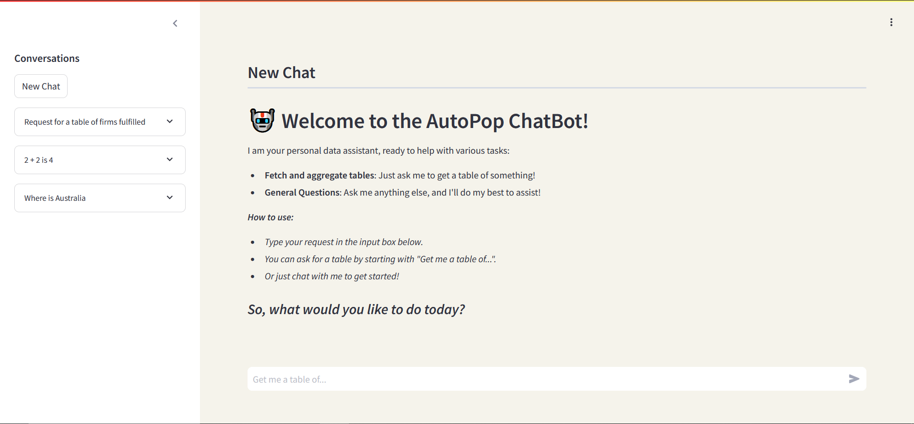

# **AutoPop ChatBot 🤖**

This repository is a chat-based database merging/retrieval system which also can perform general LLM capabilities.




## **Setup**

To run this code, first do the following:

```

git clone gregorygo12/autopop

```

Afterwards, you need to install the dependencies:

```

# For the context-matcher
cd context-match
conda env create -f environment.yml

# For the image-matcher
cd image-match
conda env create -f environment.yml

```

## **Running**

For running the code, you ideally need some `.csv` files to use as a type of knowledge base. Due to the way this code currently functions, it acts more like a datasource which gets analyzed in-chat rather than a database query system. 

Place all the files you want in `context-match/databases`.

Then, just do the following:

```

# For the context-matcher
streamlit run context-match/app.py

# For the image-matcher
cd image-match
python main.py

```